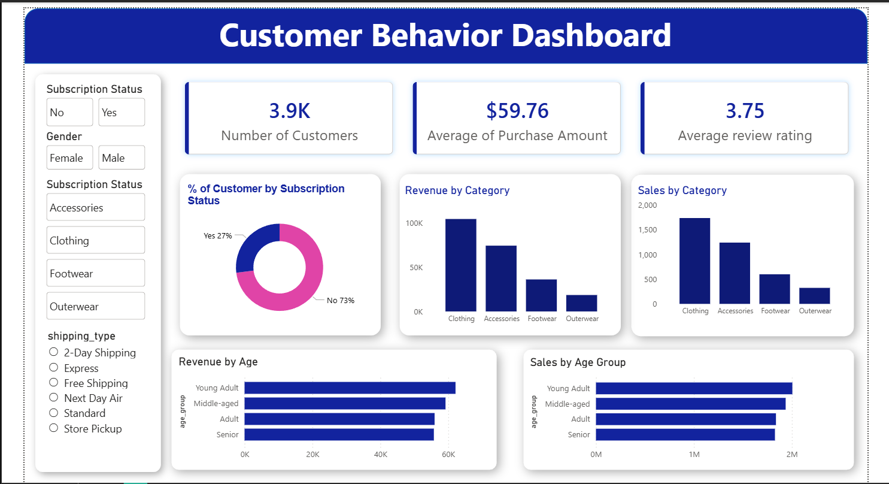

# 🛍 Customer Shopping Behavior Analysis


---

## 📌 Project Overview

This project analyzes **customer shopping behavior** using an end-to-end **data analytics workflow**.  
The objective is to extract meaningful insights from customer purchase data and visualize them using an **interactive Power BI dashboard**.

The project demonstrates how raw data can be transformed into actionable business insights using:

- **Python** for data cleaning and preprocessing  
- **PostgreSQL** for database storage  
- **SQL** for business analysis  
- **Power BI** for data visualization  

The final dashboard provides insights into:

- Customer purchasing patterns  
- Product performance  
- Revenue distribution  
- Customer segmentation  
- Impact of discounts on purchases  

---

## 🏗 Project Architecture

```
Dataset (CSV)
     │
     ▼
Data Cleaning & Transformation
(Python + Pandas)
     │
     ▼
Database Storage
(PostgreSQL)
     │
     ▼
Business Analysis
(SQL Queries)
     │
     ▼
Data Visualization
(Power BI Dashboard)
     │
     ▼
Business Insights
```

This represents a **complete real-world data analytics pipeline**.

---

## 🛠 Tools & Technologies

| Tool | Purpose |
|-----|------|
| Python | Data cleaning & preprocessing |
| Pandas | Data manipulation |
| Jupyter Notebook | Data exploration |
| PostgreSQL | Database storage |
| pgAdmin | Database management |
| SQL | Business analysis |
| Power BI | Data visualization |
| Power Query | Data transformation |
| DAX | KPI calculations |

---

## 📂 Dataset Information

The dataset contains **customer shopping behavior data** including demographics, purchasing patterns, and product preferences.

### Dataset Details

| Attribute | Description |
|---|---|
| Customer ID | Unique customer identifier |
| Age | Customer age |
| Gender | Male / Female |
| Item Purchased | Product bought |
| Category | Product category |
| Purchase Amount | Amount spent |
| Location | Customer location |
| Review Rating | Product rating |
| Subscription Status | Customer subscription |
| Shipping Type | Standard / Express |
| Discount Applied | Discount usage |
| Previous Purchases | Purchase history |
| Payment Method | Mode of payment |

### Dataset Size

- Rows: **3900**
- Columns: **18**

---

## 🧹 Data Cleaning (Python)

Data preprocessing was performed using **Python and Pandas in Jupyter Notebook**.

Key steps included:

- Handling missing values  
- Standardizing column names  
- Creating **Age Group segmentation**  
- Converting purchase frequency into numeric values  
- Removing redundant columns  
- Preparing the dataset for database storage  

These steps ensured the data was **clean, structured, and analysis-ready**.

---

## 🗄 Database Implementation (PostgreSQL)

After cleaning, the dataset was loaded into **PostgreSQL** for structured storage.

Steps performed:

1. Established database connection using Python  
2. Created a table in PostgreSQL  
3. Inserted the cleaned dataset  
4. Verified records using SQL queries  

This allowed efficient querying and analysis of the data.

---

## 📑 SQL Business Analysis

Several SQL queries were written to answer key business questions such as:

- What is the total revenue generated by male vs female customers?  
- Which customers used discounts but still spent above the average purchase amount?  
- Which products have the highest review ratings?  
- How does spending differ between shipping types?  
- Do subscribed customers spend more?  
- What is the revenue contribution of different age groups?  

Example SQL query:

```sql
SELECT gender, SUM(purchase_amount) AS revenue
FROM customer
GROUP BY gender;
```

---

## 📊 Power BI Dashboard

An **interactive Power BI dashboard** was developed to visualize key business insights.

### Dashboard Features

- Revenue analysis  
- Customer segmentation  
- Product category performance  
- Average purchase amount  
- Customer count  
- Review rating analysis  
- Age group revenue distribution  

The dashboard enables users to **interactively explore customer purchasing trends and business insights**.

---

## 📈 Key Metrics (DAX Measures)

Some important **DAX measures** created in Power BI include:

**Average Purchase Amount**

```DAX
Average Purchase Amount = AVERAGE(customer[purchase_amount])
```

**Average Review Rating**

```DAX
Average Review Rating = AVERAGE(customer[review_rating])
```

**Number of Customers**

```DAX
Number of Customers = DISTINCTCOUNT(customer[customer_id])
```

---

## 📷 Dashboard Preview

```markdown

```

---

## 📊 Key Insights

Important insights derived from the analysis:

- Loyal customers contribute significantly to repeat purchases.  
- Discount usage influences purchasing behavior.  
- Certain product categories generate higher revenue.  
- Subscription customers tend to spend more on average.  
- Product ratings highlight the most popular products.  

These insights help businesses make **data-driven strategic decisions**.

---

## 📁 Project Structure

```
Customer-Shopping-Behavior-Analysis
│
├── dataset
│   └── customer_shopping_behavior.csv
│
├── notebooks
│   └── CustomerPurchaseBehaviour.ipynb
│
├── sql
│   └── top business questions and answers.sql
│
├── powerbi
│   └── CustomerBehaviorDashboard.pbix
│
├── images
│   └── dashboard screenshots
│
└── README.md
```

---

## 🚀 Future Improvements

Possible improvements include:

- Customer **lifetime value analysis**
- Machine learning models for **purchase prediction**
- Real-time **data dashboards**
- Automated **data pipelines**

---

## 👨‍💻 Author

**Vaibhav**

Aspiring **Data Analyst** skilled in:

- Data Analytics  
- SQL  
- Python  
- Power BI  
- Data Visualization  

---

⭐ If you found this project useful, consider **starring the repository**.
